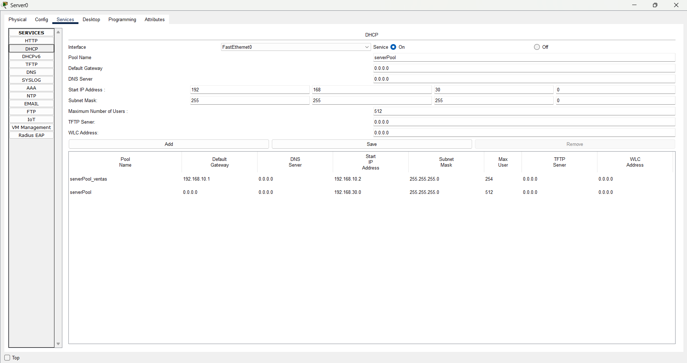

# Clase 3

## Subneting

## LACP

### Multilayer Switch 0

```bash
enable
conf t
interface range fastEthernet 0/1-3
channel-protocol lacp
channel-group 1 mode active
no shutdown
exit
do write
interface port-channel 1
switchport trunk encapsulation dot1q
switchport mode trunk
switchport trunk allowed vlan all
exit
do wr
interface range fastEthernet 0/1-3
exit
do wr
```

### Switch 5

```bash
enable
conf t
interface range fastEthernet 0/1-3
channel-protocol lacp
channel-group 1 mode active
no shutdown
do wr
interface port-channel 1
switchport mode trunk
switchport trunk allowed vlan all
exit
do wr
```

## PAGP

### Switch 5

```bash
interface range fastEthernet 0/4-6
 channel-protocol pagp
 channel-group 2 mode desirable
 no shutdown
 exit

interface port-channel 2
 switchport mode trunk
 switchport trunk allowed vlan all
 no shutdown
 exit
```

### Switch 6

```bash
interface range fastEthernet 0/4-6
 channel-protocol pagp
 channel-group 2 mode auto
 no shutdown
 exit

interface port-channel 2
 switchport mode trunk
 switchport trunk allowed vlan all
 no shutdown
 exit
```

## Configuraciones adicionales

### Switch 5

```bash
vtp domain admin
tp mode client
```

### Switch 6

```bash
vtp domain admin
tp mode client

interface fastEthernet 0/1
switchport mode access
switchport access vlan 30
exit
```

## Servidor DHCP

Configuración



Consideraciones

1. Apagar todos los demás servicios que no se utilizarán en el servidor DHCP.
2. Configurar en el router o switch multicapa la dirección del servidor DHCP al que se reenviarán las solicitudes mediante el comando `ip helper-address`.

### Router 0

```bash
interface gigabitEthernet 0/0.10
ip helper-address 192.168.30.20
exit
```
