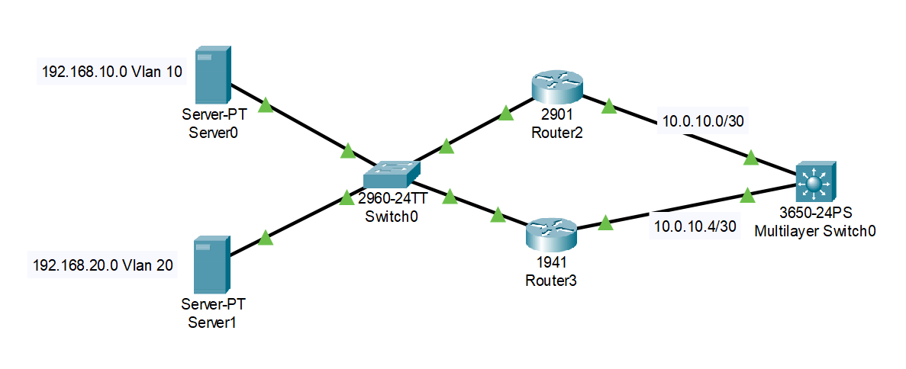

# Configuración de Red con HSRP

# Parte 1

Topología

- VLAN 10 → 192.168.10.0/24 (Server DNS)
- VLAN 20 → 192.168.20.0/24 (Server DHCP)
- HSRP para gateway redundante:
  - VLAN 10 → 192.168.10.1
  - VLAN 20 → 192.168.20.1
- Enlaces WAN:
  - R0 ↔ MLS → 10.0.10.0/30
  - R3 ↔ MLS → 10.0.10.4/30
- Protocolo de enrutamiento: **EIGRP AS 19**

---



# Switch SW1 (2960)

## Puertos de acceso

```
vlan 10
 name serverDNS

vlan 20
 name serverDHCP

interface fastEthernet0/10
 switchport mode access
 switchport access vlan10

interface fastEthernet0/11
 switchport mode access
 switchport access vlan20
```

## Troncales

```
interface range fastEthernet0/1-2
 switchport mode trunk
 switchport trunk allowed vlan all

interface range gigabitEthernet0/1-2
 switchport mode trunk
 switchport trunk allowed vlan all
```

---

# Router R0 (Principal)

## Subinterfaces (Router-on-a-Stick)

```
interface gigabitEthernet0/0.10
 encapsulation dot1Q10
 ip address192.168.10.2255.255.255.0
 standby10 ip192.168.10.1
 standby10 priority100
 standby10 preempt

interface gigabitEthernet0/0.20
 encapsulation dot1Q20
 ip address192.168.20.2255.255.255.0
 standby20 ip192.168.20.1
 standby20 priority100
 standby20 preempt
```

## Enlace WAN

```
interface gigabitEthernet0/1
 ip address10.0.10.1255.255.255.252
 no shutdown
```

## EIGRP

```
router eigrp19
 no auto-summary
 network10.0.10.00.0.0.3
 network192.168.10.00.0.0.255
 network192.168.20.00.0.0.255
```

---

# Router R3 (Secundario)

## Subinterfaces

```
interface gigabitEthernet0/0.10
 encapsulation dot1Q10
 ip address192.168.10.3255.255.255.0
 standby10 ip192.168.10.1
 standby10 priority110
 standby10 preempt

interface gigabitEthernet0/0.20
 encapsulation dot1Q20
 ip address192.168.20.3255.255.255.0
 standby20 ip192.168.20.1
 standby20 priority110
 standby20 preempt
```

## Enlace WAN

```
interface gigabitEthernet0/1
 ip address10.0.10.5255.255.255.252
 no shutdown
```

## EIGRP

```
router eigrp19
 no auto-summary
 network10.0.10.40.0.0.3
 network192.168.10.00.0.0.255
 network192.168.20.00.0.0.255
```

---

# Switch Multicapa (MLS0 - 3650)

## Interfaces enrutadas

```
interface gigabitEthernet1/0/1
 no switchport
 ip address10.0.10.2255.255.255.252

interface gigabitEthernet1/0/2
 no switchport
 ip address10.0.10.6255.255.255.252
```

## Interfaces físicas

```

interface range gigabitEthernet 1/0/10-12
 no switchport
 no shutdown
 channel-protocol lacp
 channel-group 1 mode active

```

## Interfaz Port-Channel

```
interface port-channel1
 no switchport
 ip address10.0.10.17 255.255.255.252
 no shutdown
```

## EIGRP

```
router eigrp19
 network 10.0.10.0 0.0.0.3
 network 10.0.10.4 0.0.0.3
 network 10.0.10.16 0.0.0.3
```

---

# HSRP (Redundancia)

| VLAN | IP Virtual | Router Activo |
| --- | --- | --- |
| 10 | 192.168.10.1 | R3 |
| 20 | 192.168.20.1 | R3 |

R3 tiene mayor prioridad → Activo

R0 queda en standby

---

# Verificación

## HSRP

```
show standby brief
```

## EIGRP vecinos

```
show ip eigrp neighbors
```

## Tabla de rutas

```
show ip route
```

# Parte 2

Segmento VLAN 30 y 40 con HSRP + EIGRP

Se implementan dos nuevas VLANs:

- VLAN 30 → 192.168.30.0/24
- VLAN 40 → 192.168.40.0/24

Se utiliza:

- **Router-on-a-Stick**
- **HSRP** para gateway redundante
- **EIGRP AS 19** para enrutamiento dinámico


## Puertos de acceso

```
vlan 30
 name red1

vlan 40
 name red2

interface fastEthernet 0/1
 switchport mode access
 switchport access vlan30

interface fastEthernet0/2
 switchport mode access
 switchport access vlan40
```

## Troncales hacia routers

```
interface range gigabitEthernet 0/1-2
 switchport mode trunk
 switchport trunk allowed vlan all
```

---

# Router R4

## Interfaces

### Enlace WAN

```
interface gigabitEthernet 0/0
 ip address 10.0.10.9 255.255.255.252
 no shutdown
```

### Subinterfaz VLAN 30

```
interface gigabitEthernet 0/1.30
 encapsulation dot1Q30
 ip address 192.168.30.2 255.255.255.0

 standby 30 ip 192.168.30.1
 standby 30 priority100
 standby 30 preempt
```

### Subinterfaz VLAN 40

```
interface gigabitEthernet 0/0.40
 encapsulation dot1Q40
 ip address 192.168.40.2 255.255.255.0

 standby 40 ip 192.168.40.1
 standby 40 priority 100
 standby 40 preempt
```

## EIGRP

```
router eigrp 19
 no auto-summary
 network 10.0.10.8 0.0.0.3
 network 192.168.30.0 0.0.0.255
 network 192.168.40.0 0.0.0.255
```

---

# Router R5

## Subinterfaces

### VLAN 30

```
interface gigabitEthernet 0/1.30
 encapsulation dot1Q30
 ip address 192.168.30.3 255.255.255.0

 standby30 ip192.168.30.1
 standby30 priority110
 standby30 preempt
```

### VLAN 40

```
interface gigabitEthernet 0/1.40
 encapsulation dot1Q40
 ip address192.168.40.3255.255.255.0

 standby40 ip192.168.40.1
 standby40 priority110
 standby40 preempt
```

## Enlace WAN

```
interface gigabitEthernet 0/0
 ip address 10.0.10.13 255.255.255.252
 no shutdown
```

## EIGRP

```
router eigrp19
 no auto-summary
 network 10.0.10.12 0.0.0.3
 network 192.168.30.0 0.0.0.255
 network 192.168.40.0 0.0.0.255
```

---

# Switch Multicapa MLS1 (3650)

## Habilitar enrutamiento

```
ip routing
```

## Interfaces enrutadas

```
interface gigabitEthernet 1/0/1
 no switchport
 ip address 10.0.10.10 255.255.255.252

interface gigabitEthernet1/0/2
 no switchport
 ip address 10.0.10.14 255.255.255.252
```

## Interfaces físicas

```
interface range gigabitEthernet 1/0/10-12
 no switchport
 no shutdown
 channel-protocol lacp
 channel-group1 mode active
```

## Interfaz Port-Channel

```
interface port-channel 1
 no switchport
 ip address 10.0.10.18 255.255.255.252
 no shutdown
```

## EIGRP

```
router eigrp 19
 no auto-summary
 network 10.0.10.8 0.0.0.3
 network 10.0.10.12 0.0.0.3
 network 10.0.10.16 0.0.0.3
```

---

# HSRP (Redundancia)

| VLAN | IP Virtual | Router Activo |
| --- | --- | --- |
| 30 | 192.168.30.1 | R5 |
| 40 | 192.168.40.1 | R5 |

 R5 tiene mayor prioridad → Activo

R4 queda en Standby

---

# Verificación

## HSRP

```
show standby brief
```

## EIGRP

```
show ip eigrp neighbors
```