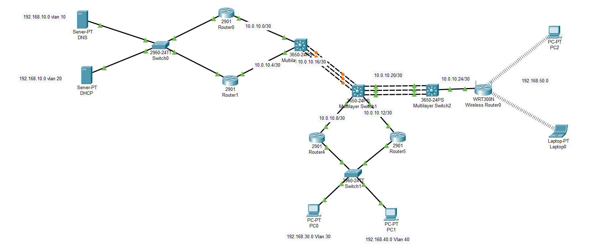

# Configuración Redes inalámbricas

## Topología extendida de la clase 5



Configuraciones para extender nuestra Red

## Multilayer Switch 1

```bash
enable
conf t
interface range gigabitEthernet 1/0/13-15
no shutdown
channel-group 2 mode active
exit
interface port-channel 2
no switchport
no shutdown
ip address 10.0.10.21 255.255.255.252
exit
router eigrp 19
network 10.0.10.20 0.0.0.3
exit
```

## Multilayer Switch 2

```bash
enable
conf t
ip routing
interface range gigabitEthernet 1/0/13-15
no shutdown
channel-group 2 mode active
interface port-channel 2
no switchport
ip address 10.0.10.22 255.255.255.252
no shutdown
interface gigabitEthernet 1/0/1
no switchport
ip address 10.0.10.25 255.255.255.252
no shutdown
router eigrp 19
no auto-summary
network 10.0.10.20 0.0.0.3
network 10.0.10.24 0.0.0.3
```

# Wireless Router0

Configuraciones básicas

## Setup


### **Internet Setup**

Define cómo el router se conecta a la red externa (ISP o red superior).

- **Internet Connection Type: Static IP**
    - Se usa cuando te asignan una IP fija.
    - Otras opciones:
        - **DHCP**: obtiene IP automáticamente.
        - **PPPoE**: usado por algunos ISP (requiere usuario/contraseña).
        - **Automatic Configuration**: similar a DHCP.
- **Internet IP Address: 10.0.10.26**
    - Dirección IP del router en la red WAN.
- **Subnet Mask: 255.255.255.252**
    - Define el tamaño de la red (en este caso /30, enlaces punto a punto).
- **Default Gateway: 10.0.10.25**
    - Dirección del siguiente salto (router aguas arriba).
- **DNS 1: 192.168.10.5**
    - Servidor DNS para resolver nombres.
    - Alternativas comunes:
        - 8.8.8.8 (Google)
        - 1.1.1.1 (Cloudflare)

### Network Setup (Red Interna)

- **Router IP: 192.168.50.1**
    - Es la puerta de enlace para los clientes.
- **Subnet Mask: 255.255.255.0**
    - Red tipo /24.

### **DHCP Server**

- **Enabled**
    - El router asigna IP automáticamente a los clientes.
- **Start IP Address: 192.168.50.2**
    - Primera IP disponible para clientes.
- **Maximum Users: 200**
    - Cantidad máxima de dispositivos.
- **IP Range: 192.168.50.2 – 192.168.50.201**
    - Rango generado automáticamente.
- **Client Lease Time**
    - Tiempo que dura asignada una IP (0 = 1 día).

## **Wireless (Configuración WiFi)**


### **Basic Wireless Settings**

- **Network Mode: Mixed**
    - Permite dispositivos B/G/N.
    - Opciones:
        - **B only**
        - **G only**
        - **N only** (mejor rendimiento)
- **SSID: Clase6**
    - Nombre de la red WiFi.
- **Radio Band: Auto**
    - Selecciona frecuencia automáticamente.
- **Wide Channel: Auto**
    - Ancho de canal dinámico.
- **Standard Channel: 1 (2.412 GHz)**
    - Canal WiFi.
    - Alternativas recomendadas:
        - Canal 1, 6 u 11 (evitan interferencia)
- **SSID Broadcast: Enabled**
    - Muestra la red públicamente.
    - Si lo desactivas:
        - La red queda oculta (más “seguridad”, pero no real)

## Wireless Security (Seguridad WiFi)


- **Security Mode: WPA Personal**
    - Tipo de seguridad.
    - Alternativas:
        - **WEP**  (inseguro)
        - **WPA2 Personal** (recomendado)
        - **WPA2 Enterprise** (con servidor RADIUS)
- **Encryption: AES**
    - Método de cifrado (el más seguro).
- **Passphrase: clase666**
    - Contraseña de la red WiFi.
- **Key Renewal: 3600**
    - Cada cuánto se renuevan las claves (en segundos).

